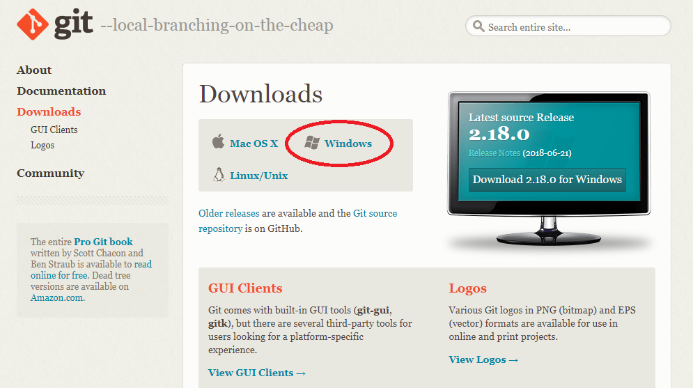
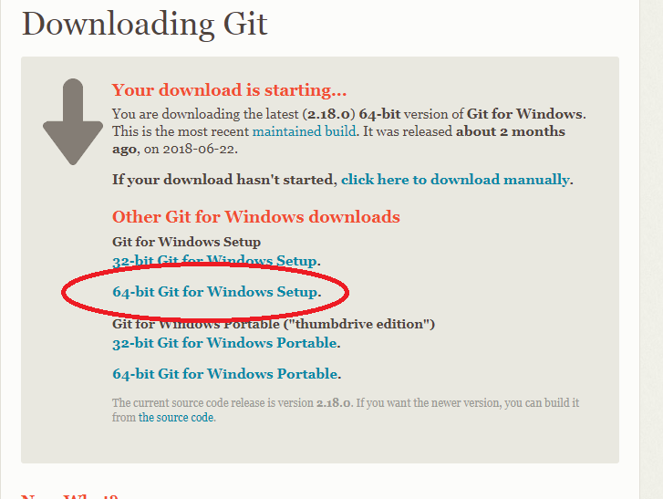
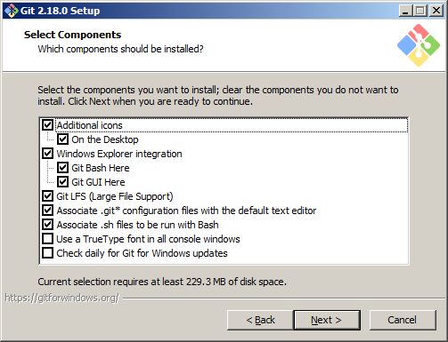
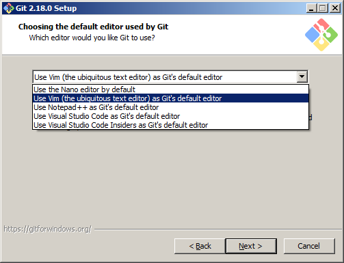
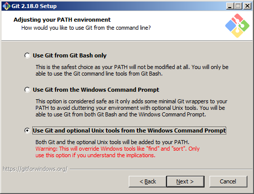

# Downloading and installing git bash

Visit [https://git-scm.com/downloads](https://git-scm.com/downloads)  

  

and download the 64-bit version...  

  

Run Git-2.18.0-64-bit.exe as adminstrator  

Check options...  

Choose text editor (for editing merge messages)...  

Choose option Unix tools... 

