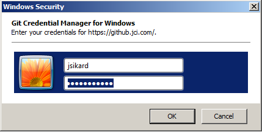

# Basic Git commands

**git help** - Getting help
```
$ git help
usage: git [--version] [--help] [-C <path>] [-c <name>=<value>]
           [--exec-path[=<path>]] [--html-path] [--man-path] [--info-path]
           [-p | --paginate | -P | --no-pager] [--no-replace-objects] [--bare]
           [--git-dir=<path>] [--work-tree=<path>] [--namespace=<name>]
           <command> [<args>]

These are common Git commands used in various situations:

start a working area (see also: git help tutorial)
   clone      Clone a repository into a new directory
   init       Create an empty Git repository or reinitialize an existing one
(...)
```

**git config** - configuration
```
git config --global user.email email@address.com
git config --global user.name "user name"
```

Checking configuration
```
git config --global user.email
git config --global user.name
```

**git clone** - Cloning a repository - note your might need to append your JCI User ID to git repository URL
```
$ git clone https://jsikard@github.jci.com/jsikard/git-workshop.git
Cloning into 'git-workshop'...
remote: Counting objects: 39, done.
remote: Compressing objects: 100% (35/35), done.
remote: Total 39 (delta 9), reused 18 (delta 3), pack-reused 0
Unpacking objects: 100% (39/39), done.
```

Note you will probably be asked for a username and password.  



Changing directory into repository
```
$ cd git-workshop
```

**git remote** information about the remote repository
```
$ git remote
origin
```

**git branch** - What branch are we working on?
```
$ git branch
* master
```

Show remote branches
```
$ git branch -r
  origin/master
```

**git log** - Show logs
```
$ git log
commit d9c9b4848004088596ccca72215e9727d225cff6 (HEAD -> master)
Author: Daniel Sikar <daniel.sikar@jci.com>
Date:   Tue Aug 7 09:43:55 2018 +0100

    Added image.

commit 6f88293c73851825709d65cb5661285214465f6f (origin/master)
Merge: 0f8ae9b 67b4052
Author: Daniel Sikar <daniel.sikar@jci.com>
Date:   Tue Aug 7 09:11:54 2018 +0100
```

Verbose switch -v
```
$ git remote -v
origin  https://jsikard@github.jci.com/jsikard/git-workshop.git (fetch)
origin  https://jsikard@github.jci.com/jsikard/git-workshop.git (push)
```


Other git commands...
**git init** - Initialise a repository, list hidden files in chronological and size descending order (-last)
```
$ cd ~/Documents/jci-git/
$ git init multi-mx-simulator
$ cd multi-mx-simulator
$ ls -last
```

Notes, git repositories can be moved around like any set of files, sent as zip file, copied to pen drive, etc.  

Please send any feedback comments to daniel.sikar@jci.com.


